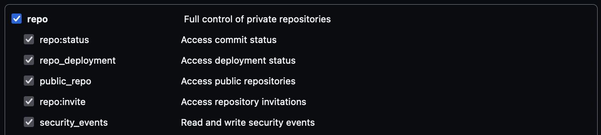

# Download Files from GitHub using cURL
## From Public Repos
1. Head to the repo where the file you want to download is located, click on the file, then 'raw'. Take note of the URL and file name with extention.
2. Execute the following command in terminal
```
curl -o FILE_NAME.EXTENTION https://raw.githubusercontent.com/GITHUB_USERNAME/REPOS/BRANCH/FILE_NAME.EXTENTION
```
3. The file should now be downloaded and saved to your home directory.
4. To run the file, execute:
```
/usr/local/bin/python3 FILE_LOCATION
```
---
## From Private Repos
1. Head to the repo where the file you want to download is located, click on the file, then 'raw'. Take note of the URL in the format https://raw.githubusercontent.com/GITHUB_USERNAME/REPOS/BRANCH/FILE_NAME.EXTENTION?token=STRING_OF_LETTERS_AND_NUMBERS

2. Then go to GitHub settings > Developer settings > Personal access tokens > Generate new token. Make sure to give it a memorable note and to tick 'Full control of private repositories'.

3. Suppose the token is abcd1234; rearrange the URL so it follows the form:
https://abcd1234@raw.githubusercontent.com/GITHUB_USERNAME/REPOS/BRANCH/FILE_NAME.EXTENTION.
Observe that '?token=STRING_OF_LETTERS_AND_NUMBERS' has been removed, and the token has been placed in front of the URL, followed by an @.

4. Now that you have a URL in the form cURL recognises, excecute it with the command:
```
curl -s -L https://abcd1234@raw.githubusercontent.com/GITHUB_USERNAME/REPOS/BRANCH/FILE_NAME.EXTENTION
```
5. The file should now be downloaded and saved to your home directory.
6. To run the file, execute:
```
/usr/local/bin/python3 FILE_LOCATION
```